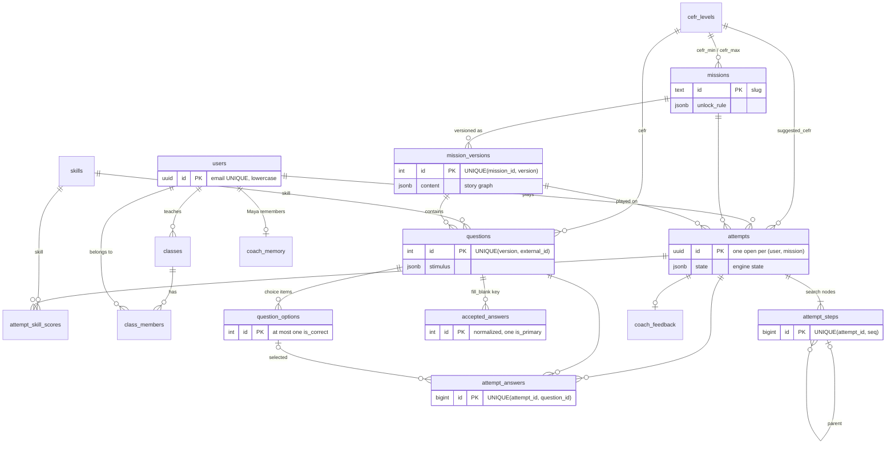

# Data model — Global AI Missions

> Owner: `data-engineer`. PostgreSQL 16 · SQLAlchemy 2.0 (typed `Mapped[...]`) · Alembic.
> Code: `backend/app/models/`, `backend/alembic/versions/0001_initial.py` (hand-written, same
> constraint names as the models; `alembic check` in the tests proves they match),
> `backend/app/repositories/` (index and signatures in `__init__.py`), `backend/seed/`.

## Principles

1. **Content is data.** Missions, the story graph and the items live in the database, loaded from
   `content/` by the seed after validation. No question or answer is in code.
2. **Relational for anything queried or constrained** (items, options, answer keys, attempts,
   answers, scores). **JSONB only** for presentation content (stimulus, unlock-rule hint, coach
   text) and for the versioned story graph, which the engine reads whole.
3. **History is immutable.** A mission version never changes; new content = a new version.
   Attempts point to the version they were played on.
4. **Every attempt is traceable step by step.** Each transition is a row (a search Node); the
   Diary is those rows followed back through their parent pointers.
5. **User-facing ids are UUIDs** (users, attempts, classes). Internal ids are integers.

## ER diagram

## Tables

| Table | Purpose | Key constraints |
|---|---|---|
| `cefr_levels` | PRE_A1 … C1 with a `rank` for comparisons (unlock rules, evidence cap). | PK `code`, UNIQUE `rank`. Seeded by the migration and the seed. |
| `skills` | grammar, vocabulary, reading, listening, speaking. | PK `code`. |
| `users` | Students, teachers, admins. argon2id hash. | UNIQUE `email`; CHECK `email = lower(email)`; CHECK role. |
| `classes`, `class_members` | A teacher's class and its students (teacher view, RBAC). | FK teacher (RESTRICT); PK (class_id, user_id). |
| `missions` | The catalog (`content/catalog.json`), upserted by slug. | FK `cefr_min/max`; `skill_focus text[]`; `unlock_rule` JSONB (PD-008). |
| `mission_versions` | Immutable, validated snapshot of a mission. `content` = the `mission.json` story graph (nodes, edges, scenes, Maya's lines). **Active version = most recently published.** | UNIQUE (mission_id, version); UNIQUE (mission_id, content_hash). |
| `questions` | The items of a version (`items.json`), without keys. | UNIQUE (version, external_id); UNIQUE (version, position) — also the ordering index; CHECK type; FK skill, cefr. |
| `question_options` | Options of choice items; `is_correct` is part of the key. | UNIQUE (question_id, option_key); **partial unique index `uq_question_options_one_correct` ON (question_id) WHERE is_correct** → at most one correct (exactly one: the engine validator, before seeding). |
| `accepted_answers` | fill_blank key: normalized (`engine.normalize_answer`), de-duplicated; `is_primary` = the first authored answer, displayed on the report. | UNIQUE (question_id, answer_normalized); partial unique: one primary per question. |
| `attempts` | Head of a run: current node + engine state; once submitted, the totals and the suggested level. | **Partial unique index `uq_attempts_one_open` ON (user_id, mission_id) WHERE status IN ('in_progress','completed')**; CHECK status; CHECK finished ⇒ ending + completed_at; CHECK submitted ⇒ submitted_at, score, counts, level; index (user_id, submitted_at DESC). |
| `attempt_steps` | One row per transition = the persisted search Node (below). | UNIQUE (attempt_id, seq) — also the (attempt_id, seq) index; self-FK `parent_step_id`; CHECK root (seq 1, `start`, no parent) vs child; CHECK on_event, maya_decision. |
| `attempt_answers` | The answer locked at a checkpoint (raw trimmed text kept for the report). | **UNIQUE (attempt_id, question_id)** (one answer per checkpoint; its leading column serves attempt_id lookups); **CHECK `num_nonnulls(selected_option_id, text_answer) = 1`**. |
| `attempt_skill_scores` | Per-skill result of a submitted attempt (written once by grading). | PK (attempt_id, skill); CHECK 0 ≤ correct ≤ total, total > 0, pct 0–100. |
| `coach_feedback` | Maya's validated feedback (or the deterministic fallback), with provider, model, prompt_version, latency. | UNIQUE attempt_id (submit phase 2 inserts `ON CONFLICT DO NOTHING`); CHECK status ready/fallback. |
| `coach_memory` | What Maya remembers: sessions_count, last 5 notes `{text, created_at}`, next greeting. | PK user_id. |

Not stored on purpose: the **profile** (PD-009, F-05) is one query over the last 3 submitted
attempts (`repositories.progress.get_profile`); card states, labels and percentages of the profile
are computed by the services.

### JSON shapes written by the services

- `attempts.state` and `attempt_steps.state_after`:
  `{"minutes_left": int, "flags": [str], "rescued": bool, "maya_mood": str}` →
  `engine.State(node_id=<current_node_id | to_node_id>, **state)`.
- `attempt_steps.action`: `null` (root) · `{"kind": "continue"}` · `{"kind": "answer", "item_id": "q02"}`
  (the answer content itself is in `attempt_answers`, never in the step).

## `attempt_steps` ↔ the search Node

| Search Node (AIMA) | Column(s) |
|---|---|
| STATE `(node_id, minutes_left, flags, rescued, maya_mood)` | `to_node_id`, `minutes_left_after`, `state_after` |
| PARENT | `parent_step_id` (NULL on the root, seq 1) |
| ACTION | `on_event` (start · always · correct · incorrect · ending) + `action` |
| PATH-COST | `path_cost` = parent.path_cost + `minutes_cost` (story-minutes used) |
| (Maya, the second agent) | `maya_decision` on arrival: quiet · hint · rescue |

Following `parent_step_id` from the ending back to the root and reversing gives the solution
path: that is the **Diary** (`engine.build_diary`). The outcome of a checkpoint is the
`on_event` (`correct`/`incorrect`) of the step that leaves it; hints are `attempt_answers.hint_shown`.

## Answer keys stay server-side

- `repositories.missions.get_answer_key(question_id)` is the one explicit path to `is_correct` and
  `accepted_answers`. `load_mission_content(version_id)` also returns keys because the engine
  grades inside RESULT; it is server-only and never serialized.
- Every other query selects ids or item fields only.

## Seed (`cd backend && uv run python -m seed`)

Idempotent, one transaction, aborts (rolls back, exit 1) on any invalid content:

1. Reference data (upsert) and `content/catalog.json` → `missions` (upsert by id).
2. For each playable mission: `content/missions/<id>/` when both `items.json` and `mission.json`
   exist, else the walking-skeleton fixture `content/missions/_fixture/` (`--fixture` forces it).
   JSON Schema + engine validator (graph + content integrity) must pass. The sha256 of both files
   decides: same hash → nothing; new hash → a new `mission_version` (version + 1) that becomes
   active; existing attempts keep theirs.
3. Demo users from `backend/app/core/demo.py` (argon2; the hash is kept if it still verifies) and
   the class "Evening B1" with both students.
4. The veteran (Leo): 4 submitted attempts from `engine.run(..., SimulatedStudent("A2_weak_listening"), seed)`
   with fixed seeds, spread over the last 14 days (oldest = lowest score, for a visible trend).
   Each trace outcome becomes a concrete answer on the server (correct → correct option / primary
   accepted text; incorrect → first wrong option / a fixed wrong word) and is **replayed through the
   engine's real RESULT**, which must reproduce the outcome. Steps, answers, scores (the backend's
   `grading` + `leveling`), mock coach feedback and coach memory are written through the same
   repositories and services as the API. If the history sits on an older version, the seed deletes
   and regenerates it (it is seed-owned demo data).

## Adding a mission, or C1 content, without schema changes

1. Add the mission to `content/catalog.json` (`cefr_range {min, max}` can be `B2`–`C1`,
   `playable: true`, an unlock rule).
2. Write `content/missions/<id>/items.json` and `mission.json` (items may use `cefr: "C1"` and any
   skill, including `speaking`).
3. `make validate-content`, then `make seed`. The seed validates, creates version 1 and its items.

Nothing in the schema is mission-specific: levels and skills are reference rows (a new level or
skill is an `INSERT`), items reference them by FK, the graph is content, and attempts, steps,
answers and scores are keyed by mission and version. What is mission-specific today lives in
code, not in the schema: the engine validator's blueprint (4/2/2/2, A1→B2 spread) and the level
bands (max B2) — a C1 mission needs its blueprint and bands to become per-mission data in the
content, which is a code change, not a migration.
